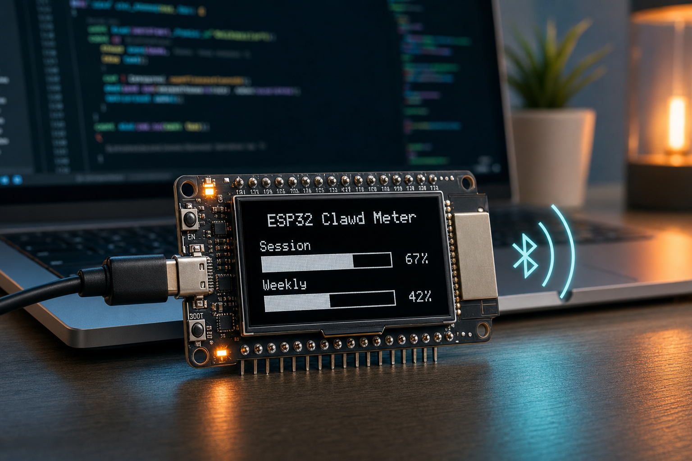

# ESP32 Clawd Meter



## 한국어

ESP32 Clawd Meter는 책상 위 작은 ESP32 OLED 화면에 Claude Code와 Codex 사용량을 번갈아 보여주는 장치입니다. PC나 노트북의 데몬이 Claude 사용량 헤더와 로컬 Codex 로그를 읽고, Bluetooth Low Energy(BLE)로 ESP32에 보내면 OLED에 `Session`/`Weekly` 또는 `5h`/`7d` 사용률이 막대와 숫자로 표시됩니다.

이 버전은 원래 Waveshare AMOLED 보드용 Clawdmeter를 **일반 ESP32-WROOM-32E + I2C OLED**에서도 쓸 수 있게 확장한 버전입니다. 제가 테스트한 보드는 `ESP32-D0WD-V3`, CP210x USB-UART, `SH1106 128x64 OLED`, `SDA=GPIO21`, `SCL=GPIO22` 구성입니다.

### 핵심 기능

- ESP32 OLED에 Claude Code / Codex 사용량 로테이션 표시
- BLE GATT로 PC 데몬이 사용량 JSON 전송
- Claude는 `Session` / `Weekly` 퍼센트와 reset 시간 표시
- Codex는 로컬 `~/.codex/logs_2.sqlite` 기반 `5h` / `7d` 토큰 사용량 추정치 표시
- 원래 Waveshare AMOLED UI와 일반 ESP32 OLED 펌웨어를 함께 보관
- API key나 비밀번호를 펌웨어에 저장하지 않음

### 일반 ESP32 OLED 빠른 실행

```bash
cd firmware
pio run -e generic_esp32
pio run -e generic_esp32 -t upload --upload-port COM4
```

Windows에서 데몬을 한 번 실행하려면:

```powershell
py -3.12 -m pip install bleak httpx
py -3.12 daemon\claude_usage_daemon.py
```

데몬은 로컬 Claude Code 자격 정보에서 토큰을 읽어 실행 시에만 사용합니다. 토큰, API key, 비밀번호는 저장소에 넣지 마세요.

Codex 사용량은 공식 quota API가 아니라 로컬 Codex 로그 기반 추정치입니다. 필요하면 아래 환경변수로 퍼센트 기준 토큰 예산을 조정할 수 있습니다.

```powershell
$env:CODEX_5H_TOKEN_BUDGET="10000000"
$env:CODEX_7D_TOKEN_BUDGET="50000000"
py -3.12 daemon\claude_usage_daemon.py
```

## English

ESP32 Clawd Meter is a tiny desk dashboard that rotates Claude Code and Codex usage on an ESP32 OLED display. A host daemon reads Claude usage headers and local Codex logs, sends a small JSON payload over Bluetooth Low Energy (BLE), and the ESP32 renders `Session`/`Weekly` or `5h`/`7d` usage as percentages and bars.

This fork keeps the original Waveshare AMOLED Clawdmeter firmware and adds a **generic ESP32-WROOM-32E + I2C OLED** firmware target. The tested board is an `ESP32-D0WD-V3` with a CP210x USB-UART bridge and an `SH1106 128x64 OLED` wired as `SDA=GPIO21`, `SCL=GPIO22`.

### Features

- Claude Code / Codex usage rotation on an ESP32 OLED
- BLE GATT data channel from the host daemon to the ESP32
- Claude `Session` / `Weekly` percentages plus reset time
- Codex `5h` / `7d` token-use estimate from local `~/.codex/logs_2.sqlite`
- Original Waveshare AMOLED firmware and generic ESP32 OLED firmware in one repo
- No API keys or passwords stored in firmware

### Generic ESP32 OLED Quick Start

```bash
cd firmware
pio run -e generic_esp32
pio run -e generic_esp32 -t upload --upload-port COM4
```

Run the Windows daemon once:

```powershell
py -3.12 -m pip install bleak httpx
py -3.12 daemon\claude_usage_daemon.py
```

The daemon reads local Claude Code credentials at runtime. Do not commit tokens, API keys, passwords, logs, virtual environments, or build outputs.

Codex usage is an estimate from local Codex logs, not an official quota API. Adjust the percentage budgets with environment variables when needed:

```powershell
$env:CODEX_5H_TOKEN_BUDGET="10000000"
$env:CODEX_7D_TOKEN_BUDGET="50000000"
py -3.12 daemon\claude_usage_daemon.py
```

## Original Clawdmeter Notes

A small ESP32 dashboard I made for my desk to keep an eye on Claude Code usage.

The original firmware runs on a [Waveshare ESP32-S3-Touch-AMOLED-2.16](https://www.waveshare.com/esp32-s3-touch-amoled-2.16.htm?&aff_id=149786) and pairs with a laptop over Bluetooth. The splash screen plays pixel-art Clawd animations that get busier when your usage rate climbs. The two side buttons send Space and Shift+Tab over BLE HID for Claude Code's voice mode and mode-toggle shortcuts.

|              Usage meter              |              Clawd animation screen              |
| :-----------------------------------: | :----------------------------------------------: |
|  |  |

The Clawd animations come from [claudepix](https://claudepix.vercel.app), [@amaanbuilds](https://x.com/amaanbuilds)'s library of pixel-art Clawd sprites, check it out, it's lovely.

## Screens

The device boots into the splash and stays there until you press the middle (PWR) button, which cycles between Usage and Bluetooth. Tap the screen anywhere (except the Reset zone on the Bluetooth screen) to flip back to the splash; tap again to dismiss it.

|              Splash               |              Usage              |                Bluetooth                |
| :-------------------------------: | :-----------------------------: | :-------------------------------------: |
|  |  |  |
|   Splash; touch-toggle anytime    | Session and weekly utilization  |    Connection status and bond reset     |

While the splash is up, the middle button cycles animations instead of screens. The firmware also auto-rotates every 20 s within the current usage-rate group, so a long stretch on the splash isn't just one Clawd on loop.

## Hardware

- [Waveshare ESP32-S3-Touch-AMOLED-2.16](https://www.waveshare.com/esp32-s3-touch-amoled-2.16.htm?&aff_id=149786) - ESP32-S3R8, 2.16" 480×480 AMOLED (CO5300 QSPI), CST9220 cap touch, AXP2101 PMU + Li-Po battery, QMI8658 IMU
- USB-C cable for flashing firmware and charging
- 3.7V Li-Po battery (MX1.25 2-pin connector, optional)

## Prerequisites

- Linux (tested on Ubuntu) or macOS
- [PlatformIO CLI](https://docs.platformio.org/en/latest/core/installation/index.html)
- Linux: `curl`, `bluetoothctl`, `busctl` (BlueZ Bluetooth stack)
- macOS: `python3` (the installer sets up a venv with `bleak` and `httpx`)
- Claude Code with an active subscription

## macOS installation

The macOS host pieces — Python daemon, LaunchAgent, and flash helper — were ported by [Chris Davidson (@lorddavidson)](https://github.com/lorddavidson). Thanks Chris!

### Flash the firmware

```bash
./flash-mac.sh                       # auto-detects /dev/cu.usbmodem*
./flash-mac.sh /dev/cu.usbmodem1101  # or pass an explicit USB serial port
```

### Pair the device

After flashing, open **System Settings → Bluetooth** and click *Connect* next to "Clawdmeter". The daemon will discover it on its next scan (~30 s).

### Install the daemon

The daemon reads your Claude OAuth token from the macOS Keychain (service `Claude Code-credentials`), polls usage every 60 s, and pushes it to the display over BLE.

```bash
./install-mac.sh
```

The installer creates a Python venv in `daemon/.venv/`, installs `bleak` and `httpx`, renders a LaunchAgent into `~/Library/LaunchAgents/com.user.claude-usage-daemon.plist`, and loads it. The first run is launched interactively so macOS prompts for Bluetooth permission.

Useful commands:

```bash
launchctl list | grep claude-usage                                          # check it's running
tail -F ~/Library/Logs/claude-usage-daemon.out.log                          # live logs
launchctl unload ~/Library/LaunchAgents/com.user.claude-usage-daemon.plist  # stop
launchctl load -w ~/Library/LaunchAgents/com.user.claude-usage-daemon.plist # start
```

## Linux installation

### Flash the firmware

```bash
cd firmware
pio run -t upload --upload-port /dev/ttyACM0
```

### Pair the device

After flashing, the device advertises as "Claudemeter". Pair it once:

```bash
# Scan for the device
bluetoothctl scan le

# When "Claude Controller" appears, pair and trust it
bluetoothctl pair F4:12:FA:C0:8F:E5    # use your device's MAC
bluetoothctl trust F4:12:FA:C0:8F:E5
```

The MAC address is shown on the Bluetooth screen — press the middle (PWR) button to cycle to it.

### Install the daemon

The daemon polls your Claude usage every 60 seconds and sends it to the display over BLE.

```bash
./install.sh
systemctl --user start claude-usage-daemon
```

Check status: `systemctl --user status claude-usage-daemon`

View logs: `journalctl --user -u claude-usage-daemon -f`

## How it works

1. The daemon reads your Claude Code OAuth token from `~/.claude/.credentials.json`.
2. It makes a minimal API call to `api.anthropic.com/v1/messages` — one token of Haiku, basically free.
3. The usage numbers come straight out of the response headers (`anthropic-ratelimit-unified-5h-utilization` and friends).
4. The daemon connects to the ESP32 over BLE and writes a JSON payload to the GATT RX characteristic.
5. The firmware parses it and updates the LVGL dashboard.
6. The firmware also tracks the rate of change of session % over a 5-minute window and picks splash animations from the matching mood group.
7. The two side buttons are independent of all of this — they send Space and Shift+Tab as BLE HID keyboard input to the paired host directly.

## Physical buttons

The board has three side buttons. Left and right do the same thing on every screen; the middle button is screen-aware.

| Button           | GPIO         | Function                                                       |
| ---------------- | ------------ | -------------------------------------------------------------- |
| **Left**         | GPIO 0       | Hold to send Space (Claude Code voice-mode push-to-talk)       |
| **Middle** (PWR) | AXP2101 PKEY | Cycle screens (Usage ↔ Bluetooth); on splash, cycle animations |
| **Right**        | GPIO 18      | Press to send Shift+Tab (Claude Code mode toggle)              |

Space and Shift+Tab go out as standard BLE HID keyboard reports, so they trigger in whatever window has focus on the paired host — not just Claude Code.

## BLE protocol

The device advertises a custom GATT service alongside the standard HID keyboard service:

|                            | UUID                                   |
| -------------------------- | -------------------------------------- |
| **Data Service**           | `4c41555a-4465-7669-6365-000000000001` |
| RX Characteristic (write)  | `4c41555a-4465-7669-6365-000000000002` |
| TX Characteristic (notify) | `4c41555a-4465-7669-6365-000000000003` |
| **HID Service**            | `00001812-0000-1000-8000-00805f9b34fb` |

JSON payload format (written to RX):

```json
{ "s": 45, "sr": 120, "w": 28, "wr": 7200, "st": "allowed", "ok": true }
```

Fields: `s` = session %, `sr` = session reset (minutes), `w` = weekly %, `wr` = weekly reset (minutes), `st` = status, `ok` = success flag.

The generic ESP32 firmware also accepts the newer dual-source payload used by the Windows daemon:

```json
{
  "claude": { "s": 45, "sr": 120, "w": 28, "wr": 7200, "st": "allowed", "ok": true },
  "codex": { "s": 12, "sr": 0, "w": 34, "wr": 0, "st": "est", "ok": true, "t5": 123456, "t7": 1234567 }
}
```

## Recompiling fonts

The `firmware/src/font_*.c` files are pre-compiled LVGL bitmap fonts.

```bash
npm install -g lv_font_conv
```

Generate each one (one at a time — `lv_font_conv` doesn't like loop-driven invocations) with `--no-compress` (required for LVGL 9):

```bash
# Tiempos Text (titles, 56px)
lv_font_conv --font assets/TiemposText-400-Regular.otf -r 0x20-0x7E \
  --size 56 --format lvgl --bpp 4 --no-compress \
  -o firmware/src/font_tiempos_56.c --lv-include "lvgl.h"

# Styrene B (large numbers 48, panel labels 28, small text 24, minimal 20)
for size in 48 28 24 20; do
  lv_font_conv --font assets/StyreneB-Regular.otf -r 0x20-0x7E \
    --size $size --format lvgl --bpp 4 --no-compress \
    -o firmware/src/font_styrene_${size}.c --lv-include "lvgl.h"
done

# DejaVu Sans Mono (32px, with spinner Unicode chars)
lv_font_conv --font assets/DejaVuSansMono.ttf \
  -r 0x20-0x7E,0xB7,0x2026,0x2722,0x2733,0x2736,0x273B,0x273D \
  --size 32 --format lvgl --bpp 4 --no-compress \
  -o firmware/src/font_mono_32.c --lv-include "lvgl.h"
```

**Important:** `lv_font_conv` v1.5.3 outputs LVGL 8 format. Each generated file must be patched for LVGL 9 compatibility:

1. Remove `#if LVGL_VERSION_MAJOR >= 8` guards around `font_dsc` and the font struct
2. Remove the `.cache` field from `font_dsc`
3. Add `.release_glyph = NULL`, `.kerning = 0`, `.static_bitmap = 0` to the font struct
4. Add `.fallback = NULL`, `.user_data = NULL` to the font struct

Without these patches, fonts compile but render as invisible.

## Converting Lucide icons

The UI uses a small set of [Lucide](https://lucide.dev) icons (bluetooth + battery states) converted to RGB565 / RGB565A8 C arrays for LVGL.

```bash
node tools/png_to_lvgl.js assets/icon_bluetooth_48.png icon_bluetooth_data ICON_BLUETOOTH_WIDTH ICON_BLUETOOTH_HEIGHT
```

Default tint is white (`0xFFFFFF`); Lucide PNGs ship as black-on-transparent and would render invisible against the dark UI without it. Pass `--no-tint` for pre-coloured artwork like the logo. Battery icons use RGB565A8 (alpha plane) so they blend cleanly over the splash; the rest are baked RGB565 over the panel colour. Paste the converter output into `firmware/src/icons.h`.

## Splash animations

The animations come from [claudepix.vercel.app](https://claudepix.vercel.app),
a library of Clawd sprites. `tools/scrape_claudepix.js` evaluates the
site's JavaScript in a Node VM to pull out frame data and palettes, then
`tools/convert_to_c.js` turns everything into RGB565 C arrays and writes
`firmware/src/splash_animations.h`.

To re-pull (e.g. when the source library updates):

```bash
node tools/scrape_claudepix.js
node tools/convert_to_c.js
pio run -d firmware -t upload
```

See `tools/README.md` for details.

## Credits

- Pixel-art Clawd animation by [@amaanbuilds](https://x.com/amaanbuilds), sourced from [claudepix.vercel.app](https://claudepix.vercel.app). Frame data and palettes scraped + converted by the tooling in `tools/`.
- Lucide icon set ([lucide.dev](https://lucide.dev), MIT) for bluetooth and battery UI glyphs.
- Anthropic brand fonts (Tiempos Text, Styrene B) — see licensing warning below.

## Licensing gray area warning

The software in this repository uses and adheres to the Anthropic brand guidelines and uses the same proprietary fonts that Anthropic has a license for but this software uses without permission as well as using assets from Anthropic such as the copyrighted Clawd mascot so even though the code in this repo is non-proprietary I will not license it myself under a copyleft license since this repo includes proprietary fonts and copyrighted assets. Please be aware of this if you fork or copy the code from this repo. **You have been warned!**
